## Table of Contents

[Javascript Quiz](#Javascript-Quiz)

[Technology Used](#Technology-Used)

[Screenshots](#Screenshots)

[Current Issues](#Current-Issues)
# Javascript Quiz

This is a responsive website built to host a javascript quiz

### Technology Used

* HTML
* CSS
* themed bootstrap from [bootswatch](https://bootswatch.com/slate/)
* Javascript

### Screenshots
|Small|Medium|Large|
|---|---|---|
| 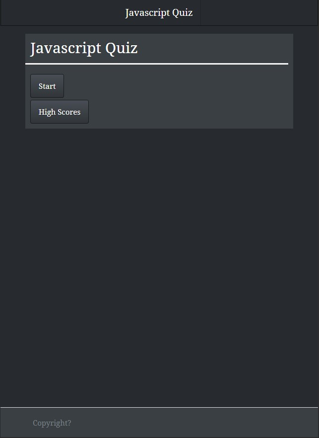 | 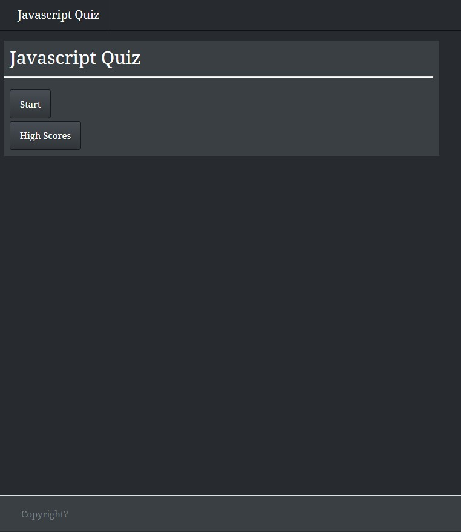 | 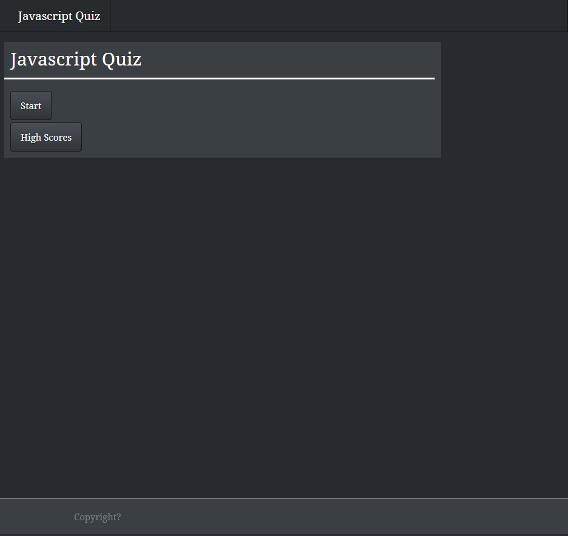 |
| 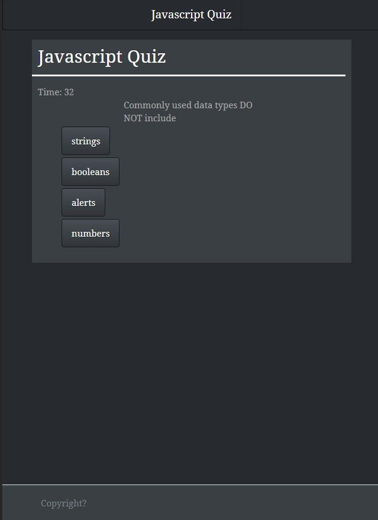 | 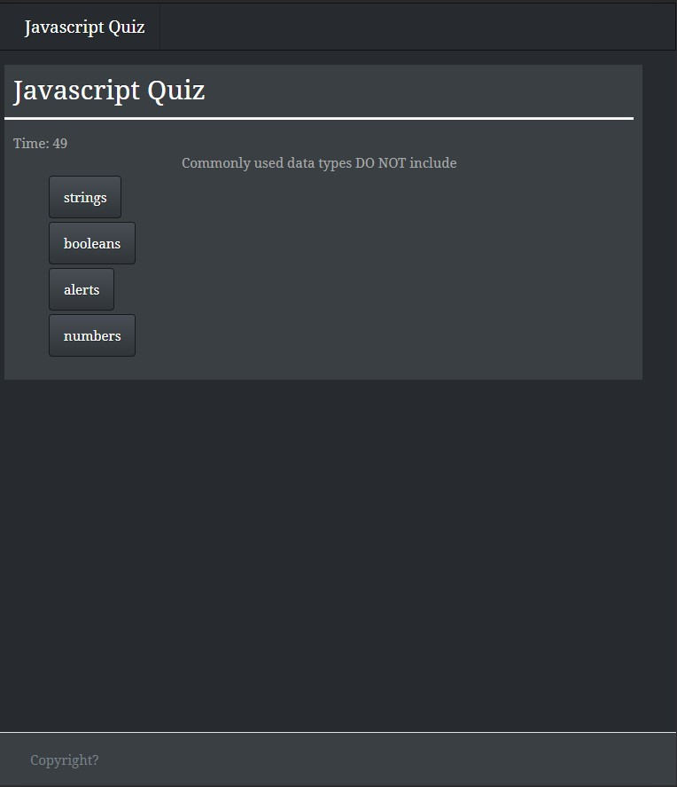 | 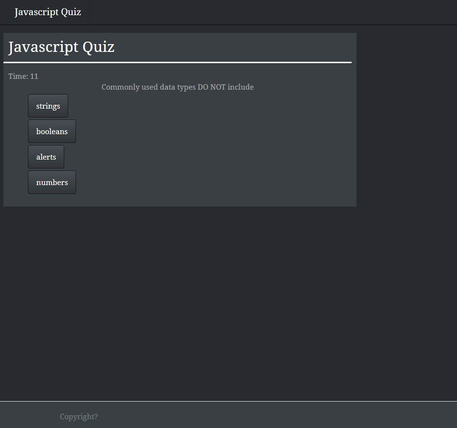 |
| 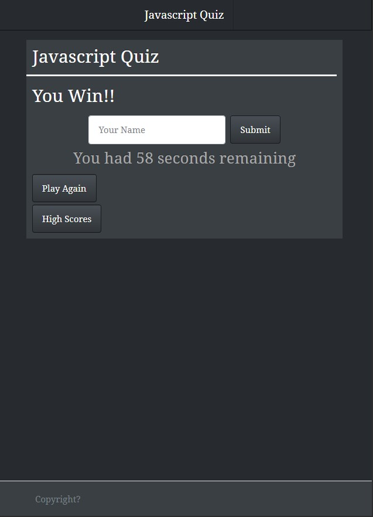 | 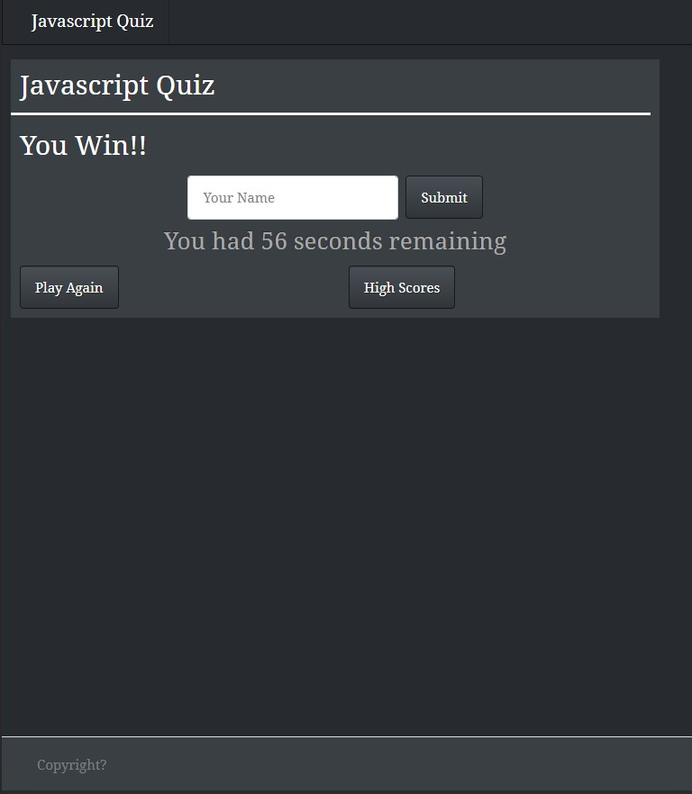 | 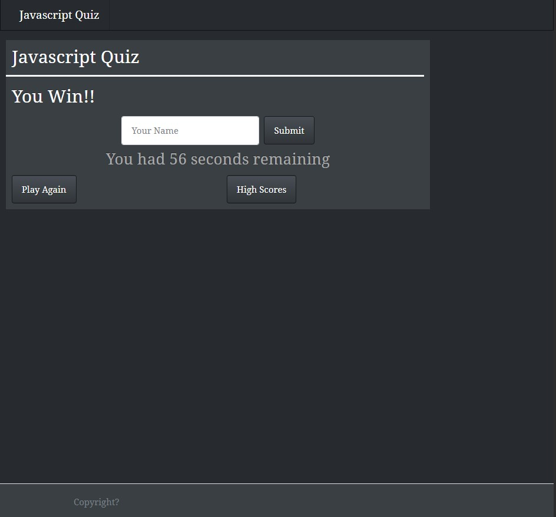 |
| 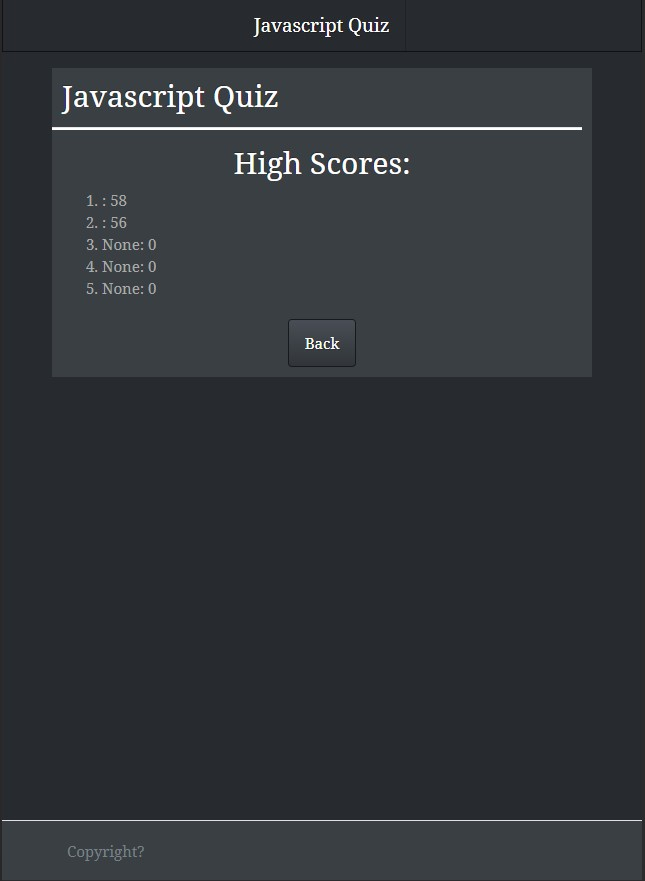 | 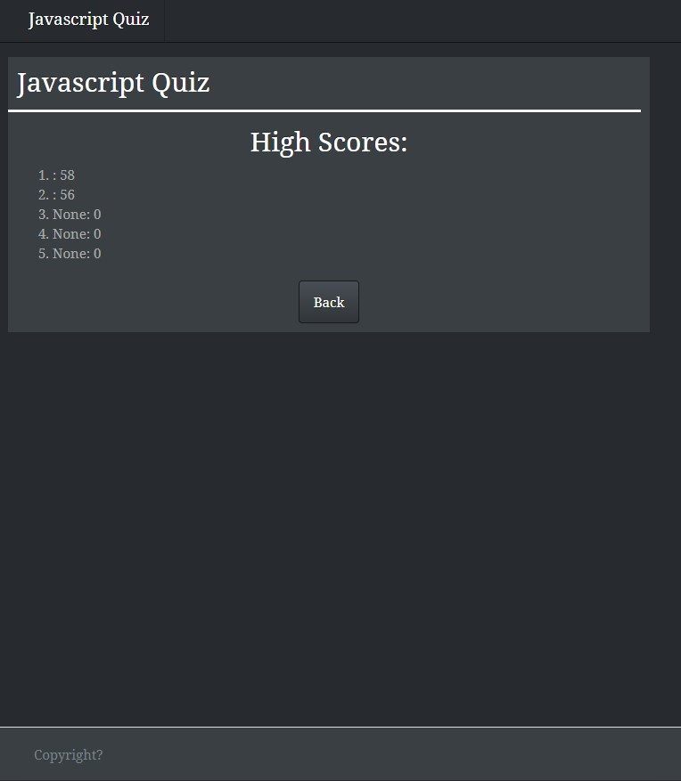 | 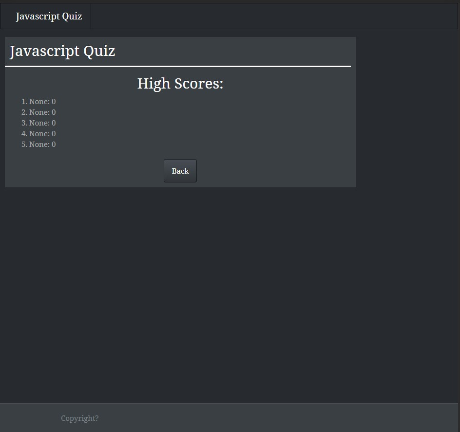 |

### Current Issues

I couldn't get the name input to work for the victory screen and I did something wrong and broke the styling.